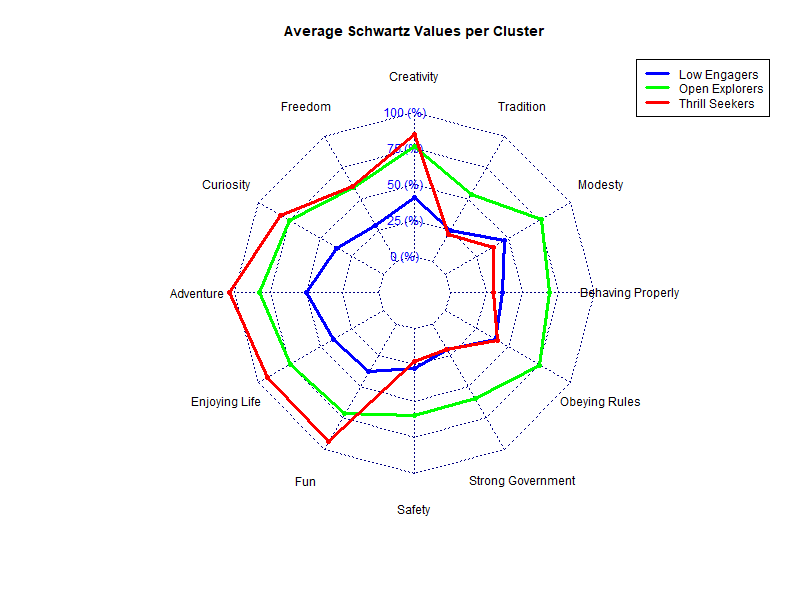

# Step A: Data Preparation

The twelve Schwartz value variables exhibit varying amounts of missing data. Valid responses per variable range from 1,889 to 2,013, while missing values range from 185 to 309. The variable *Creativity* (*ipcrtiv*) has the most missing cases (309), and *Modesty* (*ipmodst*) the fewest (185). To ensure data integrity, rows with any missing values were excluded from further analysis.

## Outlier Exploration

{ width=80% }

## Variable Descriptions

For clarity, the 12 Schwartz value variables were relabeled with more descriptive names, as follows:

| Original Variable | Label / Description         |
|-------------------|-----------------------------|
| ipcrtiv           | Creativity                  |
| impfree           | Freedom                     |
| impdiff           | Curiosity                   |
| ipadvnt           | Adventure                   |
| ipgdtim           | Enjoying Life               |
| impfun            | Fun                         |
| impsafe           | Safety                      |
| ipstrgv           | Strong Government           |
| ipfrule           | Obeying Rules               |
| ipbhprp           | Behaving Properly           |
| ipmodst           | Modesty                     |
| imptrad           | Tradition                   |

These labels are used in the following visualizations and interpretations throughout the report.

# Step B: Correlation Patterns

The correlation matrix reveals interrelationships among the Schwartz values. Many variables show moderate positive correlations (0.4 to 0.6), suggesting that respondents who endorse one value often endorse related ones. For example, *Adventure* (*ipadvnt*) strongly correlates with *Enjoying Life* (*ipgdtim*) and *Fun* (*impfun*), indicating a behavioral cluster. Conversely, values such as *Safety* (*impsafe*) and *Strong Government* (*ipstrgv*) correlate strongly with each other but weakly with stimulation-related values, reflecting distinct value domains.

The correlation plot confirms these patterns: warmer colors (red) represent stronger positive correlations, while cooler colors (blue) indicate weaker or no associations.

{ width=80% }

# Step C: PCA Projection

Principal Component Analysis (PCA) was applied to reduce the dimensionality of the 12 Schwartz value variables. The first two components explain 55.5% of the total variance (PC1: 32.9%, PC2: 22.6%), which aligns with expectations for Schwartz values and related psychological constructs.

- **PC1** differentiates between *Openness to Change* and *Conservation* value orientations.
- **PC2** captures additional variance but does not clearly align with a single theoretical dimension.

## PCA Biplot

The PCA biplot shows variable contributions:

- *ipcrtiv*, *impdiff*, and *ipadvnt* load positively on PC1, reflecting creativity and novelty.
- *imptrad*, *ipmodst*, and *ipbhprp* load in contrasting directions, indicating conservation-related values.

{ width=80% }

## PCA Colored by Demographics

Scatterplots colored by gender show no clear separation, suggesting broadly similar value profiles across genders. However, age shows moderate associations:

- **Age and PC1**: r = 0.22 → older respondents tend to score higher on PC1.
- **Age and PC2**: r = -0.36 → younger respondents tend to score higher on PC2.

This suggests age moderately influences value priorities, while gender has less impact.

### Gender

{ width=80% }

### Age

{ width=80% }

# Step D: Clustering

Exploratory clustering indicates that the value space in this Bulgarian sample is best understood as a continuous gradient rather than discrete groups. While k-means clustering was applied (guided by the Elbow method), visual inspection suggests no natural gaps between groups. The resulting clusters should therefore be interpreted cautiously, as artificial divisions rather than distinct respondent types.

## Elbow Method

{ width=80% }

## PCA Projection Colored by Cluster

{ width=80% }

# Step E: Cluster Profiles

Average value profiles reveal meaningful differences among clusters:

- **Cluster 1 (Low Engagers):** Generally low scores across most values, possibly indicating lower engagement with the Schwartz value items.
- **Cluster 2 (Open Explorers):** High scores on *Openness to Change* values (creativity, freedom, enjoyment), with moderate endorsement of *Conservation* values.
- **Cluster 3 (Thrill Seekers):** High scores on stimulation and hedonism (adventure, good times), low scores on security and tradition — suggesting an individualistic, novelty-seeking orientation.

{ width=80% }

# Step F: PCA Colored by Cluster

Here, individuals are plotted in the PCA space, colored by their cluster assignment:

- Each point represents a respondent.
- Colors indicate cluster membership.

While some overlap is expected due to the continuous nature of the value space, the visualization confirms that the three clusters align with distinct regions in the PCA projection.

{ width=80% }

# Step G: Radar Chart of Cluster Means

The radar chart summarizes mean Schwartz values for each cluster:

- **Cluster 1 (Low Engagers)**: This group scores consistently low across all Schwartz values, suggesting limited engagement or salience of these values in personal identity. They show slightly higher preferences for social order (modesty, obeying rules), but overall have a disengaged profile.
- **Cluster 2 (Open Explorers)**: These individuals strongly endorse *Openness to Change* values. They balance this with moderate scores on conservation-related values, indicating a flexible but not anti-conformist orientation.
- **Cluster 3 (Thrill Seekers)**: This group scores very high on stimulation and hedonism values, and very low on security, tradition, and conformity. They appear novelty-seeking, individualistic, and oriented toward excitement and self-direction.

This complements the PCA and profile plots by offering an intuitive, comparative visualization of each cluster’s value priorities.

{ width=80% }

# Conclusion
In conclusion, the Schwartz values in the Bulgarian sample reveal both continuous value gradients and identifiable behavioral profiles. While artificial clustering provides helpful heuristics, the underlying structure remains largely continuous, reflecting the complex nature of value orientations. Age shows some association with these orientations, while gender does not significantly differentiate value priorities.